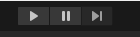
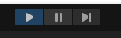
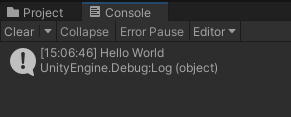

```
https://www.youtube.com/watch?v=QlpFZ4gwhBU
```

# 1 - File Setup

Unity Hub -> New project -> All templates -> 2D Core 

Project name
3D Fun

Location
Select Location

Create project


Project -> Assets -> Right Click -> Create -> C# Script

`HelloWorld.cs`


Save 

CTRL + S


Note:
1) Your script which we created is in the project, but to make it be executed 

2) you must place it on the scene

3) Select the script, and darg it onto your Main Camera in the hierarchy.


4) Now click on this camera and look at the right side of the screen where we will inspect the 

Inspector -> New Behaviour Script (Script) -> Script -> HelloWorld


Run

Click Play Button

# 2 - HelloWorld.cs

```csharp
using System.Collections;
using System.Collections.Generic;
using UnityEngine;

public class NewBehaviourScript : MonoBehaviour
{
    // Start is called before the first frame update
    void Start()
    {
        Debug.Log("Hello World");
    }

    // Update is called once per frame
    void Update()
    {
        
    }
}
```





